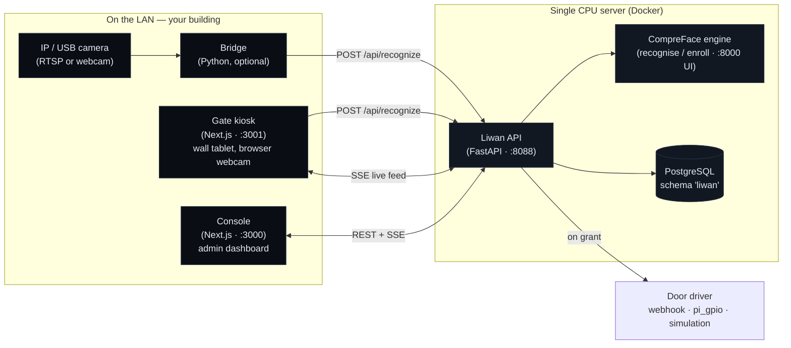

<!--
  Default brand tokens below come from brand/BRAND.md. They are the *factory*
  identity. Every deployment can rebrand from GET /api/settings → branding
  (product_name, tagline, primary_color, accent_color, logo_url, locale).
  Do not treat the name "Liwan" as fixed in the running product — it is white-label.
-->

<div align="center">

# لِيوان · LIWAN

### The threshold that knows your people.

**On-premise face attendance & access control.**
Sold once. Owned forever. Runs on your own LAN — no cloud, no subscription, no RFID cards to lose.

`Recognition engine: CompreFace (Apache-2.0)` · `CPU-only` · `Unlimited enrolled faces` · `Morocco Law 09-08 / CNDP-friendly by design`

</div>

---

## What لِيوان means

A **līwān** (لِيوان / إيوان) is the great vaulted hall in Moroccan and Islamic
architecture — open on one side through a monumental **arch**, fronting the
courtyard. It is the *threshold* where outside meets inside: the place you pass
through to enter.

The product stands in exactly that place. At the threshold of your building it
recognises the people who belong, opens the way for them, and writes down — for
every person, every day — when they arrived and when they left. No badges, no PIN
pads, no queue at the turnstile. **The arch is the doorway; Liwan is the doorway
that remembers.** A face is the key, and the key is never lost, lent, or cloned.

Liwan is **white-label by design.** The name, tagline, colours, logo, and language
shown to operators and visitors are read at runtime from `GET /api/settings → branding`.
A systems integrator can ship it to a bank as one brand and to a residence as another
without touching the code. "Liwan" is only the factory default.

## Positioning

Enterprise face attendance & access control that lives **entirely on your premises** —
no cloud, no subscription, no RFID cards to lose. One photo enrolls a person; the door
opens when it knows them; every entry and exit is logged for the day. Built for the
Moroccan enterprise, government, residential, and banking market, where biometric data
must stay inside the country and inside the building.

## Why Liwan (the differentiators)

- **Software-first, on commodity CPU.** No proprietary terminal to buy per door. Runs
  on a single Intel/AMD or ARM box you already own. The recognition core ships in a
  CPU (MobileNet) build — no GPU required.
- **Unlimited enrolled faces.** Hardware terminals cap out (e.g. ZKTeco uFace302 ≈ 3,000
  faces per device). Liwan is bounded by your server's disk and RAM, not by firmware.
- **One-time perpetual on-prem licence.** Pay once, own it. No per-seat, per-door, or
  per-month SaaS bill, and no "renew or it stops working" lock-in.
- **Data never leaves the LAN.** No cloud calls, no telemetry, no third-party SaaS in
  the recognition path. This is the core of its **Morocco Law 09-08 / CNDP** story and
  aligns with GDPR data-minimisation principles. (Legal authorisation is still the
  buyer's responsibility — see `docs/SECURITY-COMPLIANCE.md`.)
- **One photo enrolls a person.** A single clear face image creates the subject and the
  embedding. No multi-angle capture ritual.
- **No RFID cards to lose.** The number-one pain in residential complexes — lost,
  shared, and cloned proximity cards — simply disappears.
- **Many doors from one server.** Add doors and cameras in the console; one box drives
  them all over the LAN.
- **A modern web console.** A dark, fast, bilingual (FR/EN/AR) admin dashboard and a
  fullscreen door kiosk — not a 2-inch terminal screen.

> Capability claims describe the software design. Specific compliance *certifications*
> are **not** claimed; data-residency and on-prem architecture are facts, formal
> certification is the integrator's/buyer's process. See `docs/SECURITY-COMPLIANCE.md`.

## Architecture at a glance



**Data flow, one decision:** a frame reaches `POST /api/recognize` → the API calls the
CompreFace `recognize` endpoint → it takes the top match, checks the camera's similarity
threshold, the member's status, their access group, and the schedule → writes an
`access_event` → rolls the day's `attendance_days` row (first-in / last-out) → fires the
door driver when the decision is `granted`. The full decision ladder is in
[`docs/ARCHITECTURE.md`](docs/ARCHITECTURE.md) and is normative in
[`CONTRACT.md`](CONTRACT.md).

## Quickstart (single box, ~10 minutes)

> Prerequisites: Docker + Docker Compose, a LAN, and one face photo to test with.
> Everything below is local — nothing reaches the internet.

```bash
# 1) Configure. Edit secrets before anything goes to a real network.
cp .env.example .env
#    In .env, change at minimum:
#      postgres_password, LIWAN_JWT_SECRET, LIWAN_ADMIN_PASSWORD, LIWAN_DEVICE_KEY

# 2) Bring up the full stack (engine + API + Console + Gate).
docker compose up -d

# 3) Create the recognition key (one time).
#    Open the CompreFace admin UI:
open http://localhost:8000        # or browse to it from another LAN machine
#    Create an application → add a "Recognition" service → copy its API key.
#    Paste it into .env as COMPREFACE_API_KEY, then:
docker compose up -d liwan-api    # restart the API so it picks up the key

# 4) Seed a demo site, doors, access group and a few members.
python scripts/seed_demo.py       # talks only to the local API

# 5) Open the surfaces.
open http://localhost:3000        # Console  — admin dashboard (login below)
open http://localhost:3001        # Gate     — fullscreen door kiosk for a tablet
```

**First login:** `admin@liwan.local` / `liwan-admin` (from `.env` — **change it on first
run**, under Console → Settings).

To run a fixed RTSP camera through the Bridge instead of the Gate webcam:

```bash
docker compose --profile cameras up -d liwan-bridge
```

## Ports

| Port  | Service              | Audience              | Purpose                                                        |
|-------|----------------------|-----------------------|----------------------------------------------------------------|
| 8000  | CompreFace admin UI  | installer (one time)  | Create the Recognition service + API key; engine config        |
| 8088  | Liwan API (FastAPI)  | apps, devices, Bridge | The contract — REST + SSE; `/api/recognize` is the hot path    |
| 3000  | Liwan Console        | operators / admins    | Login, dashboard, enrolment, attendance, CSV, live monitor     |
| 3001  | Liwan Gate           | visitors at the door  | Fullscreen kiosk: webcam, greet-by-name, door-open animation   |
| 5432  | PostgreSQL           | internal only         | Shared DB; CompreFace owns `public`, Liwan owns schema `liwan`  |

> Only expose what you must. In production, publish 3000 / 3001 / 8088 on the LAN and
> keep 5432 and 8000 internal. See [`docs/INSTALL.md`](docs/INSTALL.md) for firewalling.

## Repository map

```
liwan/
├── README.md                 # this file
├── LICENSE                   # commercial / perpetual EULA TEMPLATE (review with counsel)
├── NOTICE                    # third-party attribution (CompreFace, Apache-2.0)
├── CONTRACT.md               # the API + data contract (source of truth for all modules)
├── docker-compose.yml        # full on-prem stack on one box
├── .env.example              # runtime configuration; copy to .env
│
├── db/
│   └── schema.sql            # Postgres schema (lives in schema "liwan")
├── brand/
│   └── BRAND.md              # design system, colour tokens, voice (default branding)
│
├── services/
│   ├── api/                  # Liwan API — FastAPI, implements CONTRACT.md
│   └── bridge/               # camera → recognise → door worker (optional, RTSP)
├── apps/
│   ├── console/              # admin dashboard (Next.js, :3000)
│   └── gate/                 # door kiosk (Next.js, :3001)
├── scripts/
│   └── seed_demo.py          # seed demo site/doors/members against the local API
│
├── docs/
│   ├── ARCHITECTURE.md       # components, data flow, schema, CPU scaling
│   ├── INSTALL.md            # on-prem single-box install, sizing, firewall, backups
│   ├── OPERATIONS.md         # daily runbook: enroll, report, CSV, add a door
│   ├── DOOR-INTEGRATION.md   # webhook/relay JSON contract + worked examples
│   └── SECURITY-COMPLIANCE.md# data residency, Law 09-08 / CNDP, retention
└── sales/
    ├── ONE-PAGER.md          # FR + EN one-pager
    ├── PRICING.md            # one-time licence tiers (suggested), vs ZKTeco math
    ├── COMPARISON.md         # Liwan vs ZKTeco vs Hikvision vs cloud SaaS
    ├── VERTICALS.md          # residential / bank / municipality / industrial / corporate
    └── PITCH-DECK.md         # 10–12 slide outline with speaker notes
```

## Licence & attribution

- **Liwan application code** (API, Console, Gate, Bridge, scripts, docs) is offered under
  a **one-time perpetual commercial licence**. The bundled [`LICENSE`](LICENSE) is a
  **template** EULA — have it reviewed by qualified legal counsel before use in a sale.
- **Liwan bundles the [CompreFace](https://github.com/exadel-inc/CompreFace) face
  recognition engine**, © Exadel Inc., licensed under **Apache License 2.0**. Liwan does
  not modify CompreFace; it runs the official images and calls its HTTP API. The full
  attribution and the obligations Liwan carries forward to its buyers are in
  [`NOTICE`](NOTICE).
- Trademarks named for comparison (ZKTeco, Hikvision, Matrix COSEC) belong to their
  respective owners and are used only for factual, descriptive comparison.

---

<div align="center">
<sub>Liwan · لِيوان — sovereign by default. Your faces, your doors, your data, your LAN.</sub>
</div>
