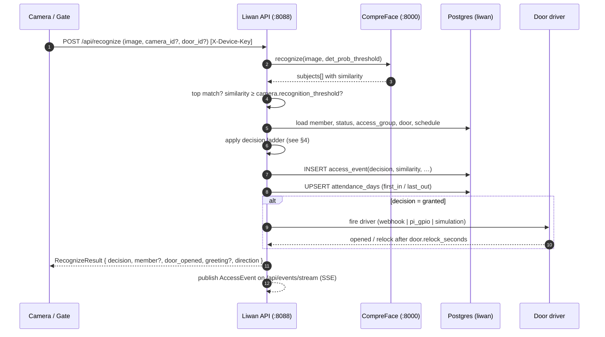

# Architecture

How Liwan is put together, how a single recognition flows through it, what the
database holds, and how it scales on plain CPU hardware. The HTTP and data shapes
here are normative in [`../CONTRACT.md`](../CONTRACT.md); this document explains the
*why* and the runtime behaviour around them.

---

## 1. Components

Everything runs in Docker on one box, on one private network (`liwan`). Nothing reaches
the internet.

| Component            | Tech            | Port | Role                                                                 |
|----------------------|-----------------|------|---------------------------------------------------------------------|
| **CompreFace engine**| Java + Python   | 8000 | The recognition core. Stores subjects + embeddings, exposes `recognize` / `enroll`. Ships in a **CPU MobileNet** build. Apache-2.0, © Exadel. |
| **PostgreSQL**       | Postgres        | 5432 | One instance, two schemas: CompreFace owns `public`; Liwan owns `liwan`. |
| **Liwan API**        | FastAPI (Python)| 8088 | Implements the contract. The only thing the UIs and devices talk to. Calls CompreFace, writes the `liwan` schema, fires door drivers. |
| **Console**          | Next.js         | 3000 | Admin dashboard: login, today overview, enrolment, attendance + CSV, live monitor, doors/cameras, settings/branding. |
| **Gate**             | Next.js         | 3001 | Fullscreen door kiosk: webcam, greet-by-name, door-open animation. For a wall tablet. |
| **Bridge**           | Python worker   | —    | Optional. Pulls frames from a fixed RTSP/USB camera and POSTs them to `/api/recognize`. Enabled with the `cameras` compose profile. |

**Two ways a face reaches the API:**

1. **Gate kiosk** — a browser captures webcam frames and calls `POST /api/recognize`
   directly. Best for a door with a tablet and a person standing in front of it.
2. **Bridge** — a headless worker reads an RTSP/USB stream and calls the same endpoint.
   Best for fixed cameras with no screen at the door.

Both authenticate to the recognition endpoint with the shared `X-Device-Key`
(`LIWAN_DEVICE_KEY`). Operator/admin traffic from the Console uses a JWT bearer token
from `POST /api/auth/login`.

---

## 2. Data flow — one recognition, end to end



The SSE publish at the end is what makes the Console **live monitor** and the Gate's
own feed update the instant a decision is made (`GET /api/events/stream`, `event: access`).

---

## 3. Request surfaces (from the contract)

Grouped by who calls them. Full shapes live in [`../CONTRACT.md`](../CONTRACT.md).

- **Auth** — `POST /api/auth/login`, `GET /api/auth/me`. JWT bearer on every `/api/*`
  except `/health`, `/api/auth/login`, and `/api/recognize`.
- **Recognition (hot path)** — `POST /api/recognize`. Device/kiosk only, `X-Device-Key`.
- **Enrolment** — `POST /api/members` (member fields + one `image`), `POST /api/members/{id}/photo`,
  list/get/patch/delete. One image is enough to be recognised.
- **Attendance** — `GET /api/attendance?date=…`, range queries, `GET /api/attendance/export.csv`,
  `GET /api/attendance/{member_id}`.
- **Events / live feed** — `GET /api/events`, `GET /api/events/stream` (SSE).
- **Dashboard** — `GET /api/stats/today`.
- **Doors & cameras** — `GET/POST /api/doors`, `POST /api/doors/{id}/open` (test pulse),
  `GET/POST /api/cameras`, plus patch/delete.
- **Settings / branding** — `GET /api/settings`, `PUT /api/settings` (admin).
- **Health** — `GET /health` → `{ status, compreface, db }`.

---

## 4. The decision ladder

Implemented by the API on every `POST /api/recognize`. Evaluated top-down; the first
rule that matches wins. This is the security heart of the product — fail closed.

1. CompreFace returns subjects with similarity. **Take the top match.**
2. `similarity < camera.recognition_threshold` → **`unknown_face`** — door stays shut.
3. Match found but member `status != active` → **`not_authorized`**.
4. Member's access group does not include this door → **`not_authorized`**.
5. Current time is outside the access group's schedule → **`off_schedule`**.
6. Otherwise → **`granted`**: fire the door driver, write the event, update attendance.
7. **Debounce**: ignore the same member at the same door within
   `attendance.min_revisit_seconds` (default 60s) to avoid double counts.

Thresholds are per-camera (`recognition_threshold` default `0.88`,
`det_prob_threshold` default `0.80`), so a bright lobby and a dim back door can be tuned
independently without touching the engine.

---

## 5. Attendance roll-up

One row per member per day in `attendance_days` (unique on `member_id, work_date`):

- **Strategy `first_in_last_out`** (default): the day's first `granted` event sets
  `first_in_ts`; the last `granted` event sets `last_out_ts`;
  `worked_seconds = last_out_ts − first_in_ts`.
- **`is_late`** is true when `first_in_ts > site.workday_start + site.grace_minutes`.
- **Direction-aware doors** (`doors.direction = in|out`) refine in/out; single-door sites
  rely on first/last.
- **Status** resolves to `present | late | absent | incomplete`. Members with no
  `granted` event on a date are reported `absent` (the attendance endpoints return all
  members for a date, not only those who showed up).

Because the roll-up is derived from `access_events`, it is reproducible: re-deriving a
day from its events yields the same `attendance_days` row.

---

## 6. Database overview (schema `liwan`)

The application schema is deliberately separate from CompreFace's `public` schema so the
two never collide in the shared Postgres instance.

```mermaid
erDiagram
    sites ||--o{ doors : has
    doors ||--o{ cameras : has
    doors ||--o{ access_events : logs
    cameras ||--o{ access_events : logs
    access_groups ||--o{ members : authorizes
    members ||--o{ access_events : generates
    members ||--o{ attendance_days : "rolls up to"
    sites ||--o{ attendance_days : scopes

    sites { uuid id; text name; time workday_start; int grace_minutes }
    doors { uuid id; text driver; jsonb driver_config; int relock_seconds; text direction }
    cameras { uuid id; numeric recognition_threshold; numeric det_prob_threshold }
    access_groups { uuid id; uuid_arr door_ids; jsonb schedule }
    members { uuid id; text full_name; text subject_name; text member_type; text status }
    access_events { bigserial id; timestamptz ts; numeric similarity; text decision }
    attendance_days { bigserial id; date work_date; timestamptz first_in_ts; timestamptz last_out_ts; bool is_late; text status }
    settings { text key; jsonb value }
    users { uuid id; text email; text role }
```

Key points:

- **`members.subject_name`** is the link to a CompreFace subject. Deleting a member
  deletes that subject too.
- **`doors.driver` / `driver_config`** make the relay pluggable per door:
  `webhook` → `{url, method, on_grant, on_deny, headers}`, `pi_gpio` → `{pin, active_high, host}`,
  `simulation` → `{}` (logs + pushes to the Gate UI). See
  [`DOOR-INTEGRATION.md`](DOOR-INTEGRATION.md).
- **`access_groups.door_ids = '{}'`** means *all doors*; **`schedule = '{}'`** means
  *any time*. So an empty group is "anyone, anywhere, anytime" — tighten it for real sites.
- **`settings`** holds white-label `branding` and global `attendance` config as JSONB
  (seeded idempotently in `schema.sql`). UIs read branding from `GET /api/settings`.
- **`users`** are console operators (`admin | operator | viewer`), separate from the
  enrolled `members`.

Indexes ship for the hot read paths: `access_events(ts DESC)`, `(member_id)`,
`(decision)`; `attendance_days(work_date DESC)`; `members(status)`, `(department)`.

---

## 7. Scaling on CPU

Liwan is designed to be *enough* on a single commodity box. There is no GPU in the path.

**Where the work is.** Recognition cost lives almost entirely in the CompreFace core
(`liwan-compreface-core`, MobileNet build). The Liwan API, Postgres, and the Next.js
apps are light. So you scale the core first.

**Levers you already have (in `.env`):**

- `uwsgi_processes` / `uwsgi_threads` — concurrency of the recognition core. More
  processes = more parallel recognitions, at the cost of RAM. Start at `2`/`2`; raise on
  bigger CPUs.
- `compreface_api_java_options` / `compreface_admin_java_options` — JVM heaps
  (`-Xmx4g` / `-Xmx2g` defaults). Raise for large subject sets.
- `max_detect_size` (`IMG_LENGTH_LIMIT`) — cap the longest image edge (default 1440).
  Smaller frames recognise faster; the Bridge/Gate can downscale before sending.
- Per-camera `det_prob_threshold` — a higher detection probability skips low-quality
  frames early, saving recognition cycles.

**Throughput shape (planning rule of thumb, not a benchmark guarantee):** on a modern
4-core CPU box, a handful of doors each seeing one person every few seconds is
comfortable. Recognition is a single forward pass per face; the limit is CPU cores ×
core concurrency, not the number of enrolled faces. Enrolled-face count is bounded by
disk/RAM, **not** by firmware as with hardware terminals — this is a core differentiator.

**When one box isn't enough (large sites):**

- Add CPU cores and raise `uwsgi_processes` first — vertical scaling covers most sites.
- The Bridge is horizontally scalable: run one Bridge process per camera (or per group),
  all pointing at the same API.
- The recognition core can be replicated and load-balanced for very high door counts;
  Postgres and the API remain single-writer and are not the bottleneck for typical
  attendance/access workloads.
- For very large enrolment sets, give Postgres more shared buffers and the core JVM/uWSGI
  more memory before reaching for more machines.

**Capacity sizing guidance** (cores, RAM, disk by site size) is in
[`INSTALL.md`](INSTALL.md).

---

## 8. Failure behaviour (fail closed)

- **CompreFace down** → `/health` reports `compreface: "down"`; `/api/recognize` cannot
  match, so it returns `unknown_face` and the door stays shut. No "fail open."
- **DB down** → `/health` reports `db: "down"`; writes fail loudly rather than silently
  dropping events.
- **Door driver error on grant** → the decision is still recorded as `granted` with a
  `reason` noting the driver failure; the physical door simply did not actuate. Operators
  see it in the live monitor and can use `POST /api/doors/{id}/open` to test.
- **Unknown camera/door id** → the API falls back to global defaults where safe and
  records the event; it never crashes the hot path on a bad device id.
